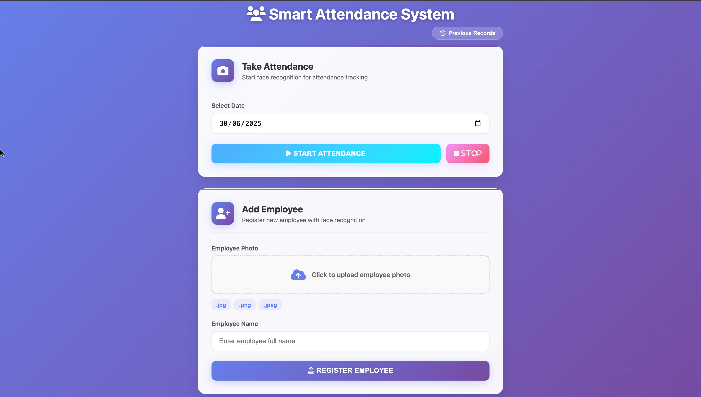
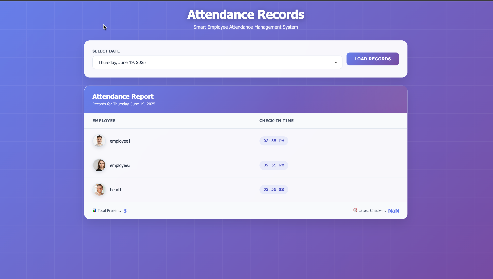

#  Smart Attendance System

A smart and modern attendance system using **face recognition** via webcam. Built with **Flask**, **OpenCV**, and **face_recognition**, it allows you to upload employee photos, take attendance in real time, and view records in a clean dashboard.

---

## 🧠 Features

- 🔍 Add employees by uploading face images
- 📷 Take attendance using webcam face recognition
- 🧾 Save attendance in **JSON**  formats
- 🗓 View past records by selecting a date
- 🧑 Shows employee name, photo, and check-in time
- 💡 Simple, responsive UI with modern look

---

## 🖼 Screenshots

### 🏠 Main Page – Upload & Take Attendance  


### 📊 Attendance Records Dashboard  


---

## 🛠 Tech Stack

- **Python 3**
- Flask
- OpenCV
- face_recognition (uses dlib)
- HTML / CSS / JavaScript for frontend

---

## 🚀 Getting Started

### 1. Clone the Repository


```bash
git clone https://github.com/karann0077/smart_attendance.git
cd smart_attendance
```
### 2. Install Dependencies

```bash
pip install -r requirements.txt
```

### 3. Run the App

```bash
python app.py
```
Then open your broswer and go to - 
```bash
http://127.0.0.1:5000/
```

Your live face detection smart attendance system is ready to use 
